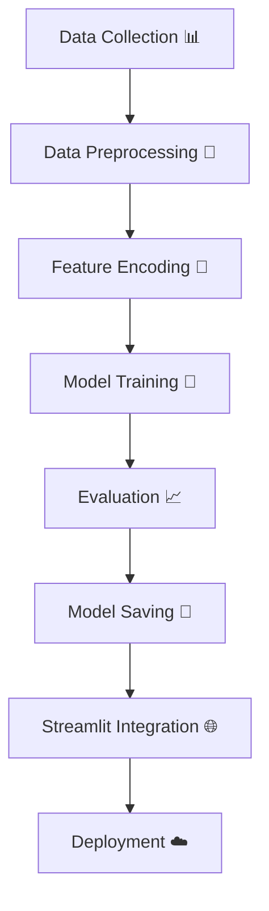

<!-- Animated Header -->
<h1 align="center">
  
</h1>

  

  
  
  
  

---

## 💡 Project Overview

Predicting health insurance payments is complex 💰 — but with the help of **Machine Learning**, we can make it smarter!  
This web app predicts a person’s **estimated insurance payment** using health-related and demographic data such as:

- 🧍‍♂️ **Age**
- ⚖️ **BMI**
- 💉 **Blood Pressure**
- 🍩 **Diabetes Condition**
- 🚬 **Smoking Habit**
- 👨‍👩‍👧‍👦 **Number of Children**

✅ Built using **Python**, **Streamlit**, and **Scikit-Learn**, this app helps users and insurers better understand expected claim amounts in real time.

---

## 🌍 Live Demo

🚀 **Try it here:** [Click to Launch the App](https://your-deployed-link.streamlit.app)

  

---

## ⚙️ Tech Stack

| Layer            | Technology                                |
| ---------------- | ----------------------------------------- |
| 🌐 Frontend      | Streamlit                                 |
| 🧠 ML Models     | Linear Regression, Random Forest, XGBoost |
| 📊 Data Handling | Pandas, NumPy                             |
| 🧮 Preprocessing | StandardScaler, LabelEncoder              |
| 💾 Model Storage | Joblib                                    |
| ☁️ Deployment    | Streamlit Cloud                           |

---

## 🧠 Machine Learning Workflow

